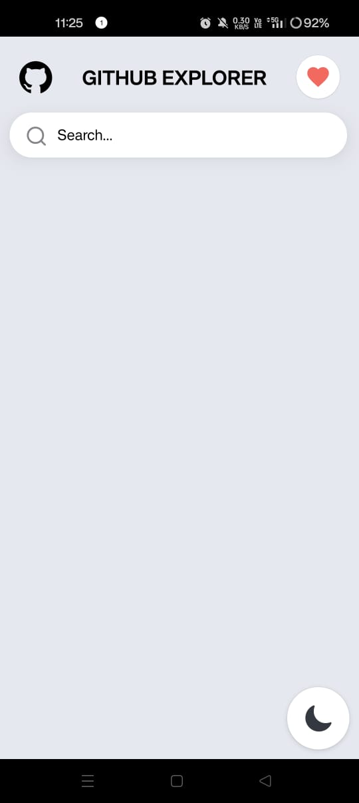
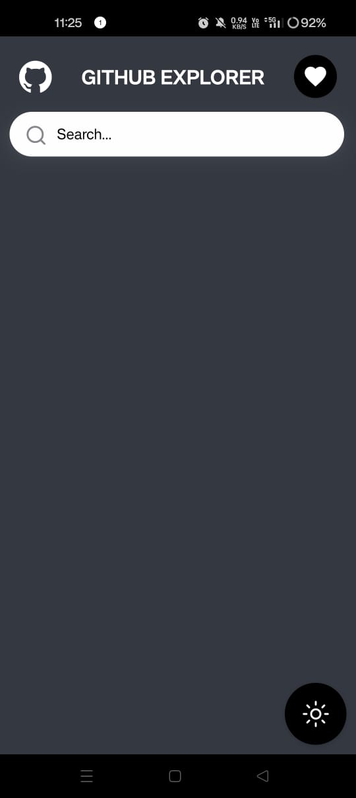
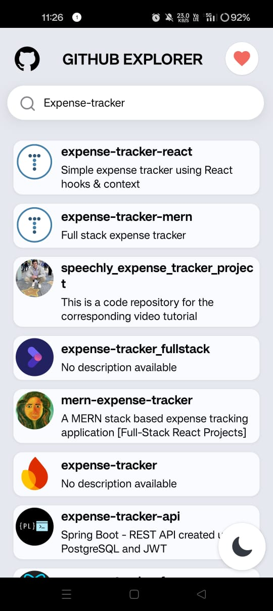
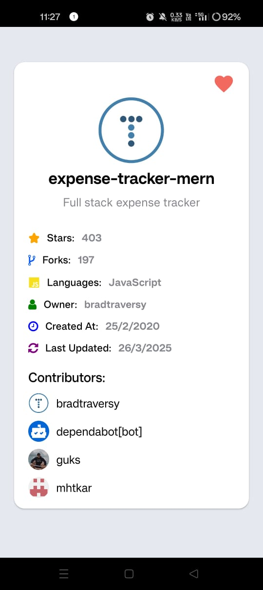
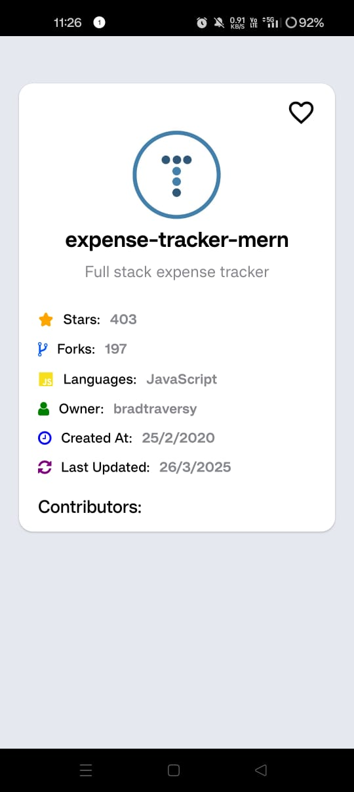
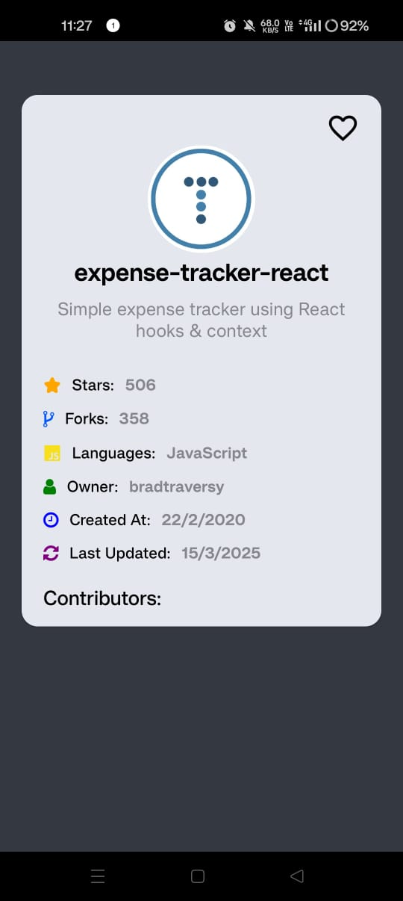
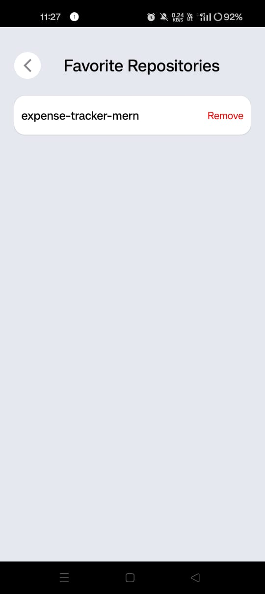
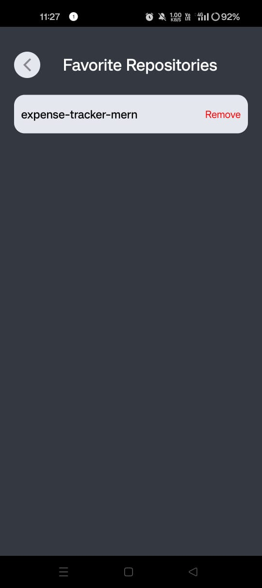

# GitHub Explorer App

GitHub Explorer is a React Native app for exploring GitHub repositories. 


 
 
## 📱 App Screenshots
<p align="center">
  
  
  
  
</p>

<p align="center">
  
  
  
  
</p>

<p align="center">
  
</p>

 

## Features 
- Search for repositories by name
- View repository details (name, description, stars, forks, language, owner info)
- Mark repositories as favorites
- Responsive design with error handling

## Requirements
- Node.js
- React Native CLI
- Android Studio (for Android)
- Xcode (for iOS, optional)
  

  
## Installation
1. Clone the repository:
   ```bash
   git clone https://github.com/Nikita-kothiwala/GithubExplorer

2. Navigate to the project folder:

  - cd GithubExplorerApp

3. Install dependencies:

  - npm install

4. Run the App:

  - npx react-native run-android

## APK File
 - You can find the apk file for installation in the [apk](apk/) folder.

## Steps to Install:

  - Navigate to the `apk` folder in this repository.
  - Download the `app-release.apk` file.
  - Transfer it to your android device.
  - Open the APK file on your device and install the app.